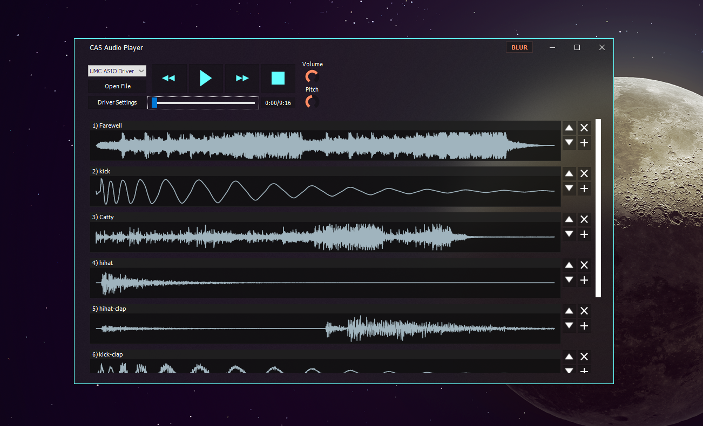

# CAS-Audio-Player
A very simple audio player built in Delphi that runs ASIO drivers and decodes input files using ffmpeg.
You can load multiple audio files and see their waveform.
It's possible to edit the playlist, moving tracks up and down and removing them.

  

# How to compile
- Clone [CAS-Engine v1.5](https://github.com/airtonhjr/CAS-Engine) inside "deps\CasAudioEngine\".
- Clone [TAcrylicForm v1.3](https://github.com/airtonhjr/TAcrylicForm) inside "deps\TAcrylicForm\".
- Open "src\CAS_AudioPlayer" and compile.
