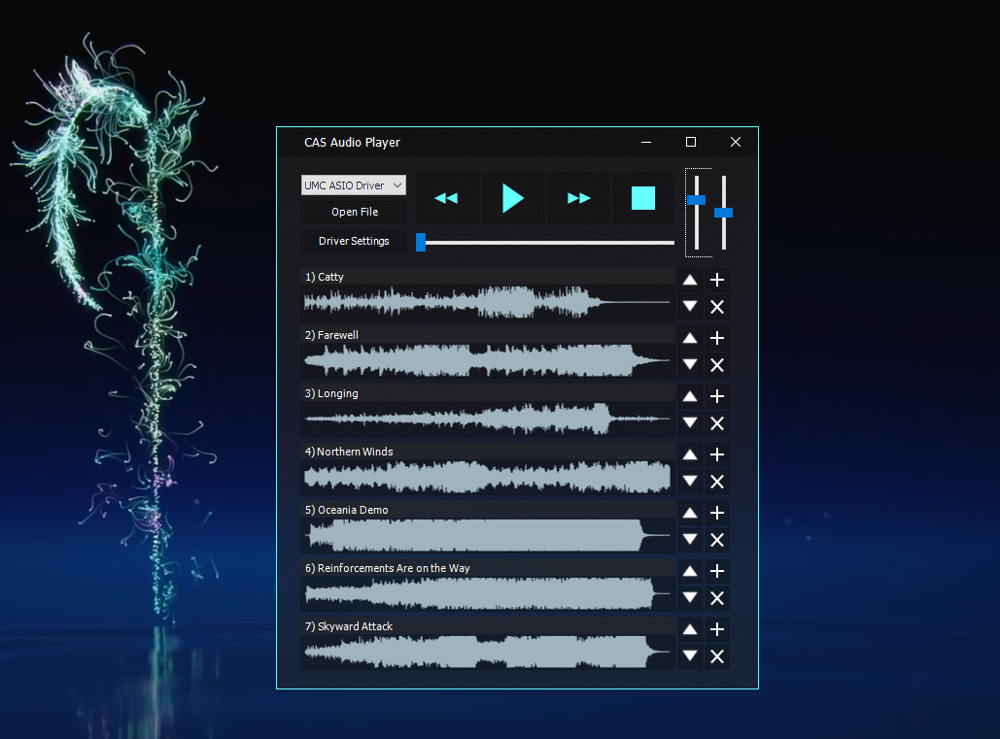

# CAS-Audio-Player
A very simple audio player built in Delphi that runs ASIO drivers decodes input files using ffmpeg.

  

# How to compile
- Clone [CAS-Engine](https://github.com/airtonhjr/CAS-Engine) inside "deps\CasAudioEngine\"
- Clone [TAcrylicForm](https://github.com/airtonhjr/TAcrylicForm) inside "deps\TAcrylicForm\"
- Open "src\CAS_AudioPlayer" and compile
